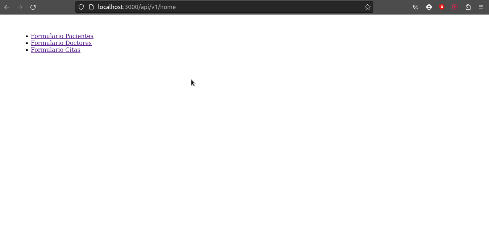
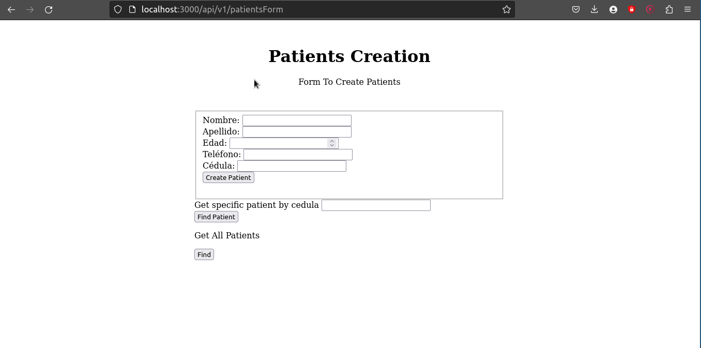
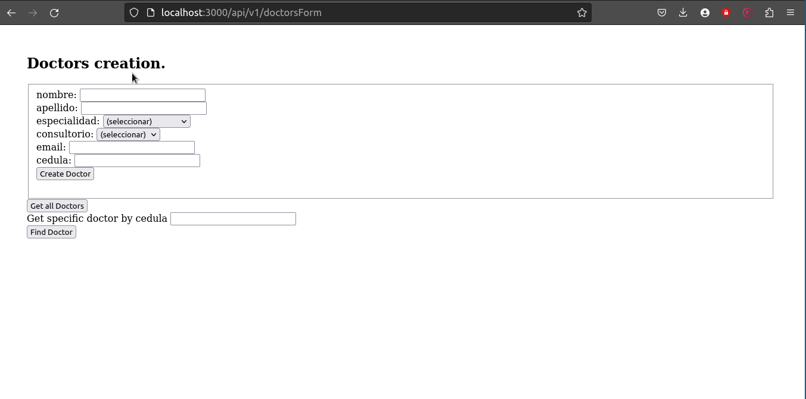
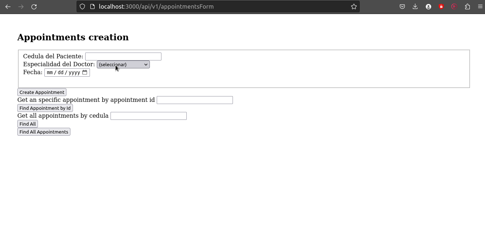

# Citas API REST

- API REST developed using some CRUD functions.

## Overview






## Functionality and Data Model

### Patients
* It's possible to create a new patient.
* It's possible to find a specific patient by it's cedula.
* It's possible to get all patients that are registered in the database.
* It's possible to delete a patient by it's cedula.
* It's not possible to create a user which cedula is already existing in the database.
* It's not possible to submit the form with blank spaces.

 ### Doctors
* It's **only** possible to create a new doctor per speciality due to the nature of the system. You cannot create more than one doctor per speciality.
* It's not possible to create a new doctor which cedula is already existing in the database.
* It's possible to find a specific doctor by it's cedula.
* It's possible to get all doctors that are registered in the database.
* It's not possible to submit the form with blank spaces.

### Appointments
* You can **only** create a new appointment if the user's already registered. Otherwise you won't be able to do so.
* You can create appointments for an user with different doctors on the same day.
* You can create an appointment for an user with the same doctor in different days.
* You can create different appointments for an user in different days.
* You can get a specific appointment with it's ID
* You can get all the appointments an user already has by it's cedula.
* You can get all the appointments that users may have made.
* You cannot create a new appointment for an user that already has an appointment with the same doctor on the same day.
* You cannot create a new appointment if the doctor for that speciality isn't registered.

### YouTube video testing the app: 
https://youtu.be/9IbaLLE3Has

## Endpoints
* The main endpoints are:
  * localhost:3000/api/v1/patients
  * localhost:3000/api/v1/doctors
  * localhost:3000/api/v1/appointments
 
* The form endpoints are:
  * localhost:3000/api/v1/patientsForm
  * localhost:3000/api/v1/doctorsForm
  * localhost:3000/api/v1/appointmentsForm
 
* The home endpoint is:
  * localhost:3000/api/v1/home

## Techstack

* JavaScript
* Node.js
* Express.js
* EJS
* MongoDB Atlas
* Mongoose

## Installation

* To make sure this project **works** on your local environment you **must** configure the **.env** file that you'll find already on the project with your MongoDB Atlas credentials. Make sure you do it before trying to test anything within the project. Otherwise you won't be able to do anything at all.

1. Clone this repository.

```shell
git clone https://github.com/Blisse1/citas-api-public
cd citas-api-public
```

2. Install the required packages.

```shell
npm install
```

3. Run the project

```shell
npm run dev
```

4. Open your browser to test the API with the following URL: https://localhost:3000/api/v1/home

## Extra info
* Developer: Andrés Morales
* Universidad Distrital & Atenea: Intermediate Backend Bootcamp
* Proudly developed using ***Neovim***. Blazingly fast!

